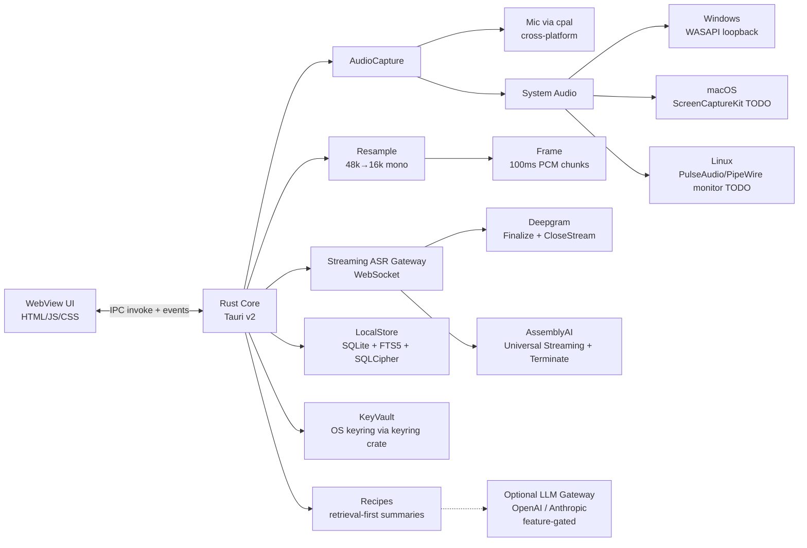
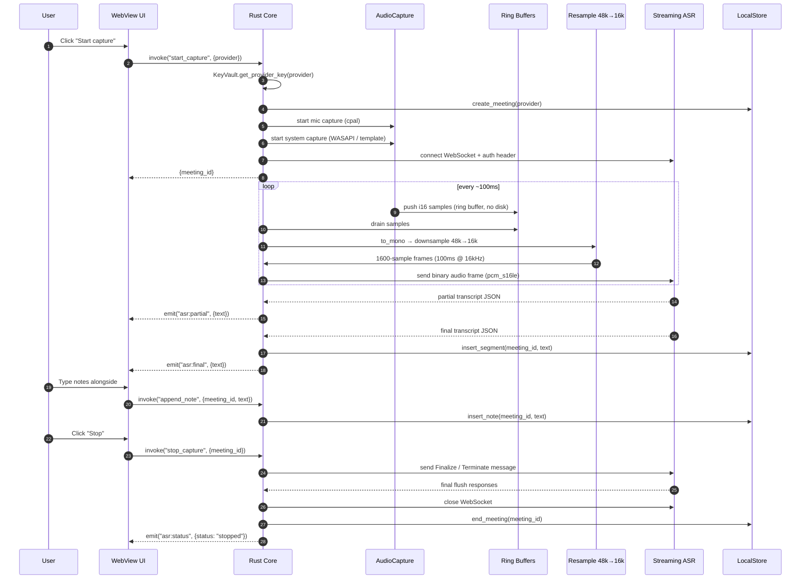
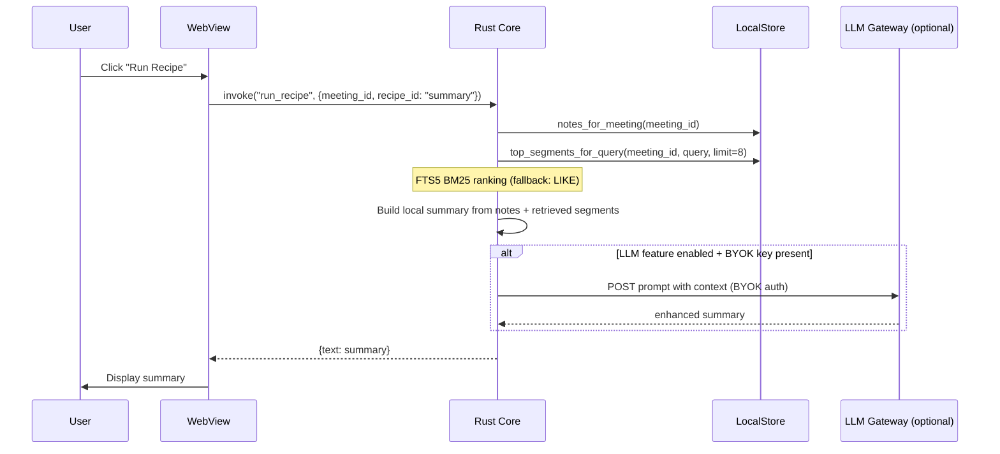

# Para-audio Architecture Diagrams

## Component diagram

```mermaid
flowchart LR
  UI[WebView UI<br/>HTML/JS/CSS] <-- IPC invoke + events --> CORE[Rust Core<br/>Tauri v2]

  CORE --> AC[AudioCapture]
  AC --> MIC[Mic via cpal<br/>cross-platform]
  AC --> SYS[System Audio]
  SYS --> WIN[Windows<br/>WASAPI loopback]
  SYS --> MAC[macOS<br/>ScreenCaptureKit TODO]
  SYS --> LNX[Linux<br/>PulseAudio/PipeWire monitor TODO]

  CORE --> RESAMPLE[Resample<br/>48k→16k mono]
  RESAMPLE --> FRAME[Frame<br/>100ms PCM chunks]

  CORE --> ASR[Streaming ASR Gateway<br/>WebSocket]
  ASR --> DG[Deepgram<br/>Finalize + CloseStream]
  ASR --> AAI[AssemblyAI<br/>Universal Streaming + Terminate]

  CORE --> DB[LocalStore<br/>SQLite + FTS5 + SQLCipher]
  CORE --> KV[KeyVault<br/>OS keyring via keyring crate]

  CORE --> RECIPE[Recipes<br/>retrieval-first summaries]
  RECIPE -.-> LLM[Optional LLM Gateway<br/>OpenAI / Anthropic<br/>feature-gated]
```

## Sequence diagram: capture session

```mermaid
sequenceDiagram
  autonumber
  participant U as User
  participant UI as WebView UI
  participant C as Rust Core
  participant AC as AudioCapture
  participant RB as Ring Buffers
  participant RS as Resample 48k→16k
  participant ASR as Streaming ASR
  participant DB as LocalStore

  U->>UI: Click "Start capture"
  UI->>C: invoke("start_capture", {provider})
  C->>C: KeyVault.get_provider_key(provider)
  C->>DB: create_meeting(provider)
  C->>AC: start mic capture (cpal)
  C->>AC: start system capture (WASAPI / template)
  C->>ASR: connect WebSocket + auth header
  C-->>UI: {meeting_id}

  loop every ~100ms
    AC->>RB: push i16 samples (ring buffer, no disk)
    C->>RB: drain samples
    C->>RS: to_mono → downsample 48k→16k
    RS->>C: 1600-sample frames (100ms @ 16kHz)
    C->>ASR: send binary audio frame (pcm_s16le)
  end

  ASR-->>C: partial transcript JSON
  C-->>UI: emit("asr:partial", {text})

  ASR-->>C: final transcript JSON
  C->>DB: insert_segment(meeting_id, text)
  C-->>UI: emit("asr:final", {text})

  U->>UI: Type notes alongside
  UI->>C: invoke("append_note", {meeting_id, text})
  C->>DB: insert_note(meeting_id, text)

  U->>UI: Click "Stop"
  UI->>C: invoke("stop_capture", {meeting_id})
  C->>ASR: send Finalize / Terminate message
  ASR-->>C: final flush responses
  C->>ASR: close WebSocket
  C->>DB: end_meeting(meeting_id)
  C-->>UI: emit("asr:status", {status: "stopped"})
```

## Sequence diagram: recipe execution

```mermaid
sequenceDiagram
  participant U as User
  participant UI as WebView
  participant C as Rust Core
  participant DB as LocalStore
  participant LLM as LLM Gateway (optional)

  U->>UI: Click "Run Recipe"
  UI->>C: invoke("run_recipe", {meeting_id, recipe_id: "summary"})
  C->>DB: notes_for_meeting(meeting_id)
  C->>DB: top_segments_for_query(meeting_id, query, limit=8)
  Note over C: FTS5 BM25 ranking (fallback: LIKE)
  C->>C: Build local summary from notes + retrieved segments

  alt LLM feature enabled + BYOK key present
    C->>LLM: POST prompt with context (BYOK auth)
    LLM-->>C: enhanced summary
  end

  C-->>UI: {text: summary}
  UI->>U: Display summary
```

## Data flow: privacy boundaries

```mermaid
flowchart TB
  subgraph LOCAL["Local Device (trusted boundary)"]
    MIC[Microphone] --> RING1[Ring Buffer<br/>memory only]
    SYS[System Audio] --> RING2[Ring Buffer<br/>memory only]
    RING1 --> MIX[Mix + Resample]
    RING2 --> MIX
    DB[(SQLCipher DB<br/>encrypted at rest)]
    KV[(OS Keyring<br/>BYOK secrets)]
  end

  subgraph CLOUD["Cloud (requires BYOK)"]
    ASR[ASR Provider<br/>Deepgram / AssemblyAI]
    LLM[LLM Provider<br/>OpenAI / Anthropic]
  end

  MIX -->|16k PCM via WSS| ASR
  ASR -->|text transcripts| DB
  DB -->|retrieved context| LLM
  KV -->|API keys<br/>never to WebView| ASR
  KV -->|API keys| LLM

  style LOCAL fill:#1a2a1a,stroke:#4a4
  style CLOUD fill:#2a1a1a,stroke:#a44
```
